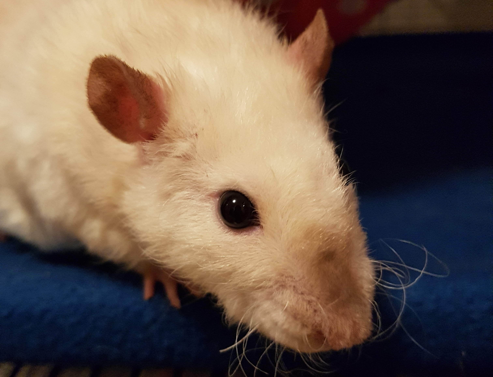

## KIK-LG219 - Command Line Tools for Linguists
##### 06.01.2020

This course is one of the language technology courses you can take in University of Helsinki without any background knowledge of coding etc. "coputer stuff". In the table below are listed courses about language technology that are usually provided by the university.


| Course code    | Course name    | Recommended year    |
| ---------	 | ----------	  | ------  |
| KIK-405	 | Introduction to Language Techonology		| 1st	|
| KIK-LG219	 | Command Line Tools for Linguists  		| 	|
| KIK-LG208	 | Ohjelmointia lingvisteille			| 2nd or 3rd	|
| KIK-LG210	 | Koneoppimisen perusteet lingvisteille	| 2nd or 3rd	|
| KIK-LG211 	 | Luonnollisen kielen käsittelyn sovellusten rakentaminen	| 3rd	|


This course offers a guided entryway to command line environment, as you might guess from the course title, and teaches some simple ways to modify text and textfiles . The course has a very practical approach to problem solving, which the student gets to practice themselves when they are working on the homework assignments. In retrospect, I think every linguist would benefit from the tools this course offers, regardless of whether they have the soul of a "nerd" or not. 


#### Week 1: Basics of a Command Line Environment

The first week consisted of the very basic stuff like navigating a command line environment, copying, pasting, making new directories etc. Also setting up the environment itself had to be done. Everyday commands like
```
$ rm foo.txt
```
that can be used to remove files and directories, were introduced. Personally I had briefly used a terminal environment in my previous studies, so I was familiar with most of the topics.

#### Week 2: Managing what's happening

The second week included things like compressing files, changing permissions, process PID and connecting to a remote server. Most of this week's topics weren't visited afterwars but on the other hand some commands like

```
$ chmod 755 foo.txt
```

that chages the writing and reading permissions of a file, were useful many times. Especially the whole concept of PID was new to me.

### Week 3: Basic Corpus Processing

This week used the command `grep` heavily. It lets you search text etc for patterns you can define using regular expressions if necessary. Regex had been a topic in the previous course, _Introduction to Language Technology_, so this process wasn't that foreign, but was taken to the n-th level, or that's what it felt like at times. An example of using regex with `grep` is for instance

```
$ grep 'github' foo.txt
```

Where `grep` will find all lines which contain the word type 'github'.

The week also covered different ways to modify a text, including cutting off lines etc. I learned how to use formatted text files way better than previously, outside of command line environment as well.

#### Week 4: Advanced Corpus Processing

While `grep` from 3rd week is a command used to find a pattern in a text, one of this weeks commands,

```
sed
```

can be used in a similar way as `grep`, but you can also replace the strings it finds with something different. After learning `grep`, `sed` felt somewhat confusing as it was slightly similar but with completely different commands. Other major topic of the week was using pipelines.

#### Week 5: Scripting and Configuration Files

This week was by far the most interesting and rewarding one. It was mostly all about learning to write simple scripts, but figuring them out was very rewarding. Scripts written during the week were used mostly for language processing.
```
for name in "$M"
do
    ls $name
done
```

For example this piece of script takes the variable _M_ and lists all the units in it usind command `ls`.
Also the concept of configuration files was covered.


#### Week 6: Installing and Running Programs

The main topic of the week was installing programs from terminal. For that to happen, root user abilities and such were covered. Other topics were using python virtual environment, and creating Makefiles. All of these things  were complitely new information to me, but using Makefiles was definitely the most interesting part.

For instance, this piece of code in a Makefile will remove all files in directory _results/_ and all files ending with *no_md.txt* in the directory _data/_ if you run it from the command line using `$make clean`.

```
clean:
	rm -f results/* data/*no_md.txt

```


#### Week 7: Version Control

This week was mostly an ease into the final assignment of creating Github pages. So it consisted of
* What is Github
* What you can do with Github
* How to use Github
* Branches, repositories etc. in Github
* Github in a nutshell
* Github

For instance, if you want to crate a new branch in Github called _github-is-cute_, just give a command

```
$ git branch github-is-cute
```

and Github creates a Github branch for your Github project.


_This text has been co-written by Frans. Here's a picture of him. Please note his curly whiskers._

