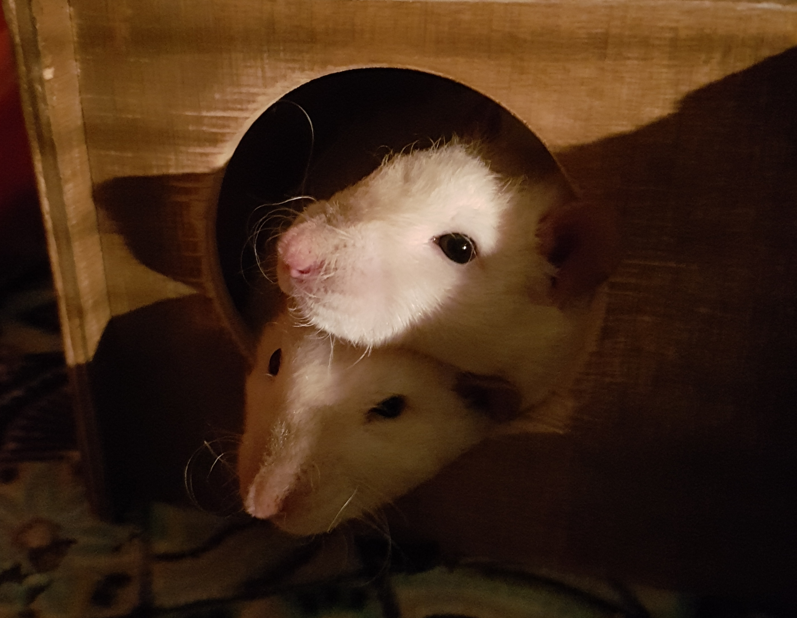

## Introduction

After two mentally challenging? years of studying at the Physics Department at the University of Turku, I managed to change my life around with support from my family and friends and applied to University of Helsinki to study linguistics as my major. Now as I have completed half of my first year with passion towards my field, the excitement and blah is difficult to put into words.

I applied to my department with headstrong goals to become a researcher but now as I have scraped the surface of language technology, I would also like to see the depths. Thought of realistic employment is also tempting me towards more practical thinking.

## Find me on

[GitHub](https://github.com/hamaro777)

Or if you want to meet me in person, I may be found [here](https://fi-fi.facebook.com/pages/Ravintola-Ruiskumestari/212527152108153).

## Contact

My email address is of the form first_name.a.last_name@helsinki.fi. 

## Courses I've Taken (a selection)

[Introduction to Language Technology](https://courses.helsinki.fi/fi/kik-405), fall 2019

[Corpus Linguistics and Statistical Methods](https://courses.helsinki.fi/fi/kik-404/120705419), fall 2019

[Basics of Speech Analysis](https://courses.helsinki.fi/fi/kik-lg212/120960613), fall 2019

[Phonetics and Phonology](https://courses.helsinki.fi/fi/kik-lg101), fall 2019

[Introduction to General Linguistics and Phonetics](https://courses.helsinki.fi/fi/aykik-401), summer 2019

## Projects

My only project **for now**, is the currently ongoing project of completing a course _Introduction to Command Line Tools for Linguists_. Check my progress so far [here](https://github.com/hamaro777/cmdline-course)

## Misc. 

I'm also an Event Organization Member for the department club of linguists in Helsinki University, also known as [Aspekti](http://www.ling.helsinki.fi/aspekti/).

I'll be working as a teacher assistant in the upcoming Corpuslinguists course, see the course outline [here](https://courses.helsinki.fi/fi/kik-404/120705419).

If you would like to plant a tree or two, check out this [donation campaign](https://teamtrees.org/)!